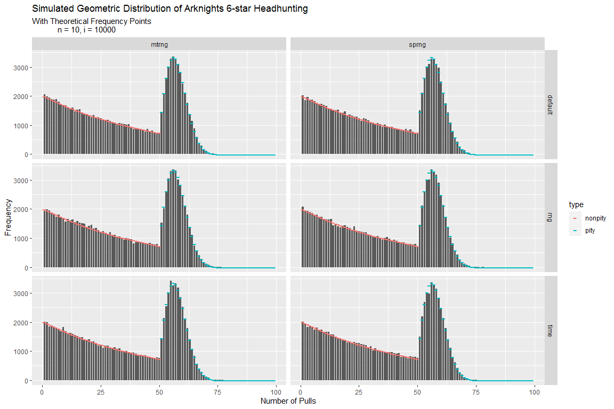
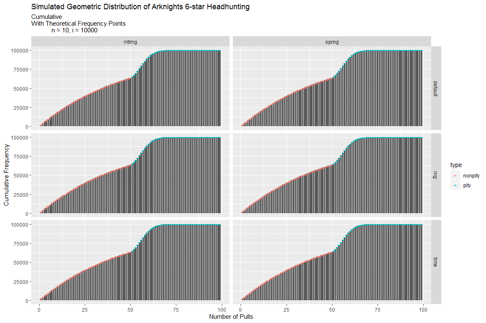
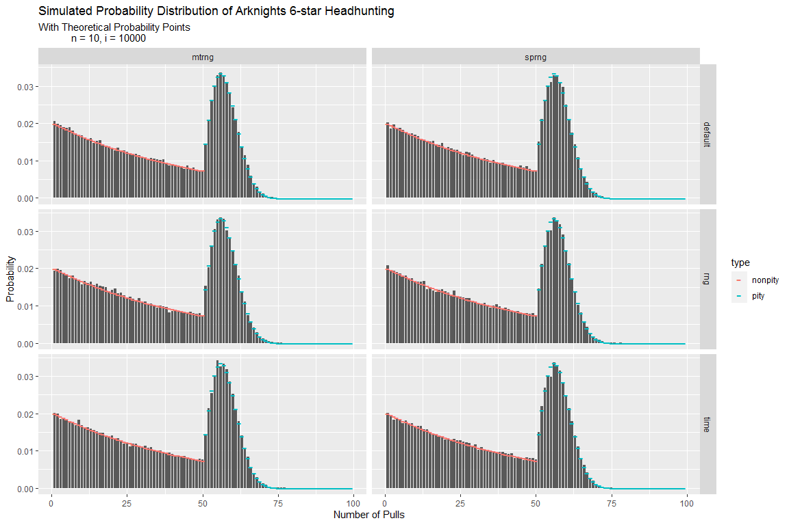

---

### Abstract

Theoretical probabilities are important to predict your chances in getting 6★ Operators in Arknights. While the first 50 consecutive non-6★ pulls follow the conventional geometric pdf which is $P(X=x)=p(1-p)^{x-1}$ with fixed probability $p$, but it's impossible in the case where the pity system starts and the $p$ varies each pull.

A similar problem was found in [StackExchange][stack] where it asks about the specific distribution similar to geometric pdf but with varying but deterministic probabilities. It is found out that the theoretical probabilities of pulling a 6★ Operator after consecutive non-6★ Operators follows a more general version of geometric distribution in which accounts for the varying probabilities.

The probability of getting a 6★ Operator is much sooner than you would expect. Upon calculation from the general version of geometric pdf, results show that there is a 76% chance that you will pull a 6★ Operator on your **55th** pull or earlier in your streak, 95% on your **62nd** pull or earlier, and 99% on your **67th** pull or earlier. The probabilities shown accounts the near impossibility of making into pull 99 because the probability of ending the current streak (or getting a non-6★ Operator) decreases exponentially as you approach the $99^{th}$ pull.

To validate, we tested each simulated data and determine whether they follow the theoretical probabilities. For this analysis, there are 6 sets of simulated data where their differences comes down to their RNGs and seeding methods. Results indicate that the all six sets of simulated data follow the calculated theoretical probabilities.

The computed theoretical probabilities can be used to accurately predict your chances of getting a 6★ Operator. This would highly benefit users to plan ahead on their rolls and their desired outcomes. Further research on other gacha rating system with varying rates could be possible using the general formula for geometric pdf.

---

## Background

In our previous [analysis][eda], we explored the distribution of Non-6★ Headhunting Streak using simulated data. The two simulated data differs from its RNG that decides randomness. These are *Mersenne Twister RNG* and *Subtractive PRNG*. In R, the default RNG used is the former one through `set.seed()` while the latter was created in a custom function.

However, simulated data are not good approximations on the theoretical probabilities. We did a research on how to get the geometric pdf but it only revolves around the usual formula: $P(X=x)=p(1-p)^{x-1}$. [SurfChu85][surf] stated that it would be possible for the first 50 pulls, but the calculations would be incorrect once the pity system kicks in.

A similar question was raised on [StackExchange][stack] where it finds the appropriate distribution to predict varying $p$ given $x$. As a response, username [Did](https://math.stackexchange.com/users/6179/did) replied:

> If the probability of success at trial $n$ is $p_n$ and the sequence $(p_n)_{n\geq 1}$ is deterministic, then the number $X$ of trials needed to get one success is such that, for every $n\geq 1$,
> $$P(X=n)=p_n\prod_{k=1}^{n-1}(1-p_k)$$

It is noticeable that the probability of increasing your non-6★ pull streak decreases as much as the increase of probability of getting a 6★ operator. This means that it would be near impossible to get into pull 99 because your probability of advancing to the $n^{th}$ pull decreases as you approach the $99^{th}$ pull. These probabilities tend to decrease exponentially which results to a very low chance. For example:

> A rigged Headhunting system has a base 6★ Operator rate of 92% and increases by 2% for the next pull given that you did not obtained a 6★ Operator from the previous ones. This means that you have a 92% chance on your first pull, 94% on the second pull, until it reaches the fifth pull where you will be guaranteed a 6★ Operator.

However, the probability of failing 4 times in a row in this system is:

$$(0.08)(0.06)(0.04)(0.02)=\frac{384}{100000000}$$

which is a very low chance. Therefore, you will acquire the operator in about 1 to 3 pulls, but almost never in the 5th pull (after 4 consecutive fails). This concept applies on the Arknights' pity system.

The formula below is general version of the geometric pdf but derived according to Arknights Headhunting system and its conditions. For simplification and clarity, $x$ would be the $x^{th}$ pull where you obtained your 6★ Operator, $p_x$ is the current rate at the $x^{th}$ pull, and $P(X=x)$ as the probability of getting a 6★ Operator considering the exponential decrease of probabilities as you approach the $99^{th}$ pull.

$$P(X=x)=p_{x}\prod_{n=1}^{x-1}(1-p_n)\\p_x=max(0.02,0.02(x-49))\\ 0\leq p_x\leq 1\\ 1\leq x\leq 99\\ x\ \epsilon\ \mathbb{N}$$

In most gacha games, $p_x$ is constant and will produce the same result as the conventional formula. In the case of Arknights Headhunting, they have a unique $p_x$ because of the pity system and it would only work on the formula above.

---

## Methodology

In this part, we would determine the theoretical probabilities in Arknights' Gacha System and test if there are differences with the simulated data. While most of the details on the simulation can be found in our previous [EDA][eda] and in [Github][gh], I won't be discussing every part of it, but I would give a quick run through the important details.

These are the corresponding dependencies that would be used in this analysis. For plotting, the library `ggplot2` shall be used, while the functions to be used are stored in `arkfunc.R`. The R file, function details, and codebook can be obtained in the [Github][gh] repository.


```r
library(ggplot2)
source("arkfunc.R")
```

Here is the given scenario.

> There are 10000 accounts that contain a record of their pull streaks from 10 of their 6★ Operators. The streaks follow the Arknights 6★ Headhunting rate (including the Pity System). Overall, there are 100000 recorded pull streaks.

In addition, the simulated data was done four times with different RNGs and methods of seeding. As done in the previous analysis, there are 2 types of RNG used which is *Mersenne-Twister RNG*, the default RNG for R, and *Subtractive PRNG* that is used in the development of Arknights as mentioned by @sr229.

Unlike the previous simulation, there would be an additional classification. Each user (iteration) has its own seed to be used for their corresponding RNGs as recommended by @sr229 in his [EDA][eda2]. To determine the seed used by the user, it's either of the following:

1. Based from `master.seed` (Fixed Seeding)
2. Based from a number generated by the RNG (RNG Seeding)
3. Based from UNIX time (Time Seeding)

This means that there are six sets of simulated data where each has a unique type based from the said two attributes. The code below assigns these six simulations to their corresponding variables `exp1` to `exp6`.


```r
# Mersenne-Twister RNG
exp1 <- mtrng_sim(10, 10000, 362867)            # Fixed Seeding
exp2 <- mtrng_sim(10, 10000, 362867, "rng")     # RNG Seeding
exp3 <- mtrng_sim(10, 10000, seedtype = "time") # Time Seeding

# Subtractive PRNG
exp4 <- sprng_sim(10, 10000, 362867)            # Fixed Seeding
exp5 <- sprng_sim(10, 10000, 362867, "rng")     # RNG Seeding
exp6 <- sprng_sim(10, 10000, seedtype = "time") # Time Seeding
```

These results would be compared to the theoretical frequencies and probabilities that is from `arknights_dist()` function. The theoretical data for 100000 records would be stored in the `theo_df` variable.


```r
theo_df <- arknights_dist(100000)
```

To determine their statistical differences, we would be using paired t-test. There are two pull streaks that correspond to the same pull and it would test their differences in frequencies and probabilities across all pulls (from 1 to 99).

---

## Results and Discussion

Here are the results of the simulation and some details on the theoretical distribtuion.

### Tables

Below is the complete table of theoretical probabilities, frequencies, and others. For more details on the descriptions, visit `CODEBOOK.md`.


```r
print(theo_df)
```

```
##    pulls    type rate freq c.freq         prob     c.prob         odds    fail.odds
## 1      1 nonpity 0.02 2000   2000 2.000000e-02 0.02000000 2.040816e-02 4.900000e+01
## 2      2 nonpity 0.02 1960   3960 1.960000e-02 0.03960000 1.999184e-02 5.002041e+01
## 3      3 nonpity 0.02 1921   5881 1.920800e-02 0.05880800 1.958417e-02 5.106164e+01
## 4      4 nonpity 0.02 1882   7763 1.882384e-02 0.07763184 1.918497e-02 5.212412e+01
## 5      5 nonpity 0.02 1845   9608 1.844736e-02 0.09607920 1.879406e-02 5.320829e+01
## 6      6 nonpity 0.02 1808  11416 1.807842e-02 0.11415762 1.841126e-02 5.431458e+01
## 7      7 nonpity 0.02 1772  13188 1.771685e-02 0.13187447 1.803640e-02 5.544345e+01
## 8      8 nonpity 0.02 1736  14924 1.736251e-02 0.14923698 1.766929e-02 5.659536e+01
## 9      9 nonpity 0.02 1702  16626 1.701526e-02 0.16625224 1.730979e-02 5.777077e+01
## 10    10 nonpity 0.02 1667  18293 1.667496e-02 0.18292719 1.695772e-02 5.897018e+01
## 11    11 nonpity 0.02 1634  19927 1.634146e-02 0.19926865 1.661294e-02 6.019406e+01
## 12    12 nonpity 0.02 1601  21528 1.601463e-02 0.21528328 1.627527e-02 6.144292e+01
## 13    13 nonpity 0.02 1569  23097 1.569433e-02 0.23097761 1.594457e-02 6.271726e+01
## 14    14 nonpity 0.02 1538  24635 1.538045e-02 0.24635806 1.562070e-02 6.401761e+01
## 15    15 nonpity 0.02 1507  26142 1.507284e-02 0.26143090 1.530351e-02 6.534450e+01
## 16    16 nonpity 0.02 1477  27619 1.477138e-02 0.27620228 1.499285e-02 6.669847e+01
## 17    17 nonpity 0.02 1448  29067 1.447595e-02 0.29067823 1.468859e-02 6.808007e+01
## 18    18 nonpity 0.02 1419  30486 1.418644e-02 0.30486467 1.439059e-02 6.948987e+01
## 19    19 nonpity 0.02 1390  31876 1.390271e-02 0.31876738 1.409872e-02 7.092844e+01
## 20    20 nonpity 0.02 1362  33238 1.362465e-02 0.33239203 1.381285e-02 7.239637e+01
## 21    21 nonpity 0.02 1335  34573 1.335216e-02 0.34574419 1.353285e-02 7.389425e+01
## 22    22 nonpity 0.02 1309  35882 1.308512e-02 0.35882930 1.325861e-02 7.542271e+01
## 23    23 nonpity 0.02 1282  37164 1.282341e-02 0.37165272 1.298999e-02 7.698235e+01
## 24    24 nonpity 0.02 1257  38421 1.256695e-02 0.38421966 1.272688e-02 7.857383e+01
## 25    25 nonpity 0.02 1232  39653 1.231561e-02 0.39653527 1.246917e-02 8.019779e+01
## 26    26 nonpity 0.02 1207  40860 1.206929e-02 0.40860456 1.221674e-02 8.185488e+01
## 27    27 nonpity 0.02 1183  42043 1.182791e-02 0.42043247 1.196948e-02 8.354580e+01
## 28    28 nonpity 0.02 1159  43202 1.159135e-02 0.43202382 1.172729e-02 8.527122e+01
## 29    29 nonpity 0.02 1136  44338 1.135952e-02 0.44338335 1.149004e-02 8.703186e+01
## 30    30 nonpity 0.02 1113  45451 1.113233e-02 0.45451568 1.125766e-02 8.882843e+01
## 31    31 nonpity 0.02 1091  46542 1.090969e-02 0.46542537 1.103002e-02 9.066166e+01
## 32    32 nonpity 0.02 1069  47611 1.069149e-02 0.47611686 1.080704e-02 9.253231e+01
## 33    33 nonpity 0.02 1048  48659 1.047766e-02 0.48659452 1.058861e-02 9.444113e+01
## 34    34 nonpity 0.02 1027  49686 1.026811e-02 0.49686263 1.037464e-02 9.638891e+01
## 35    35 nonpity 0.02 1006  50692 1.006275e-02 0.50692538 1.016504e-02 9.837644e+01
## 36    36 nonpity 0.02  986  51678 9.861492e-03 0.51678687 9.959710e-03 1.004045e+02
## 37    37 nonpity 0.02  966  52644 9.664263e-03 0.52645113 9.758572e-03 1.024740e+02
## 38    38 nonpity 0.02  947  53591 9.470977e-03 0.53592211 9.561534e-03 1.045857e+02
## 39    39 nonpity 0.02  928  54519 9.281558e-03 0.54520367 9.368512e-03 1.067405e+02
## 40    40 nonpity 0.02  910  55429 9.095927e-03 0.55429960 9.179422e-03 1.089393e+02
## 41    41 nonpity 0.02  891  56320 8.914008e-03 0.56321360 8.994182e-03 1.111830e+02
## 42    42 nonpity 0.02  874  57194 8.735728e-03 0.57194933 8.812713e-03 1.134724e+02
## 43    43 nonpity 0.02  856  58050 8.561013e-03 0.58051035 8.634937e-03 1.158086e+02
## 44    44 nonpity 0.02  839  58889 8.389793e-03 0.58890014 8.460777e-03 1.181925e+02
## 45    45 nonpity 0.02  822  59711 8.221997e-03 0.59712214 8.290159e-03 1.206249e+02
## 46    46 nonpity 0.02  806  60517 8.057557e-03 0.60517969 8.123009e-03 1.231071e+02
## 47    47 nonpity 0.02  790  61307 7.896406e-03 0.61307610 7.959256e-03 1.256399e+02
## 48    48 nonpity 0.02  774  62081 7.738478e-03 0.62081458 7.798829e-03 1.282244e+02
## 49    49 nonpity 0.02  758  62839 7.583708e-03 0.62839829 7.641661e-03 1.308616e+02
## 50    50 nonpity 0.02  743  63582 7.432034e-03 0.63583032 7.487683e-03 1.335527e+02
## 51    51    pity 0.04 1457  65039 1.456679e-02 0.65039711 1.478212e-02 6.764932e+01
## 52    52    pity 0.06 2098  67137 2.097617e-02 0.67137328 2.142560e-02 4.667314e+01
## 53    53    pity 0.08 2629  69766 2.629014e-02 0.69766342 2.699997e-02 3.703708e+01
## 54    54    pity 0.10 3023  72789 3.023366e-02 0.72789708 3.117623e-02 3.207572e+01
## 55    55    pity 0.12 3265  76054 3.265235e-02 0.76054943 3.375452e-02 2.962567e+01
## 56    56    pity 0.14 3352  79406 3.352308e-02 0.79407251 3.468586e-02 2.883019e+01
## 57    57    pity 0.16 3295  82701 3.294840e-02 0.82702091 3.407098e-02 2.935049e+01
## 58    58    pity 0.18 3114  85815 3.113624e-02 0.85815714 3.213686e-02 3.111692e+01
## 59    59    pity 0.20 2837  88652 2.836857e-02 0.88652571 2.919684e-02 3.425028e+01
## 60    60    pity 0.22 2496  91148 2.496434e-02 0.91149006 2.560352e-02 3.905713e+01
## 61    61    pity 0.24 2124  93272 2.124239e-02 0.93273244 2.170342e-02 4.607569e+01
## 62    62    pity 0.26 1749  95021 1.748956e-02 0.95022201 1.780089e-02 5.617695e+01
## 63    63    pity 0.28 1394  96415 1.393784e-02 0.96415985 1.413485e-02 7.074714e+01
## 64    64    pity 0.30 1075  97490 1.075205e-02 0.97491189 1.086891e-02 9.200555e+01
## 65    65    pity 0.32  803  98293 8.028195e-03 0.98294009 8.093168e-03 1.235610e+02
## 66    66    pity 0.34  580  98873 5.800371e-03 0.98874046 5.834211e-03 1.714028e+02
## 67    67    pity 0.36  405  99278 4.053435e-03 0.99279389 4.069933e-03 2.457043e+02
## 68    68    pity 0.38  274  99552 2.738321e-03 0.99553221 2.745840e-03 3.641873e+02
## 69    69    pity 0.40  179  99731 1.787115e-03 0.99731933 1.790314e-03 5.585612e+02
## 70    70    pity 0.42  113  99844 1.125882e-03 0.99844521 1.127151e-03 8.871924e+02
## 71    71    pity 0.44   68  99912 6.841075e-04 0.99912932 6.845758e-04 1.460759e+03
## 72    72    pity 0.46   40  99952 4.005138e-04 0.99952983 4.006743e-04 2.495793e+03
## 73    73    pity 0.48   23  99975 2.256808e-04 0.99975551 2.257318e-04 4.430036e+03
## 74    74    pity 0.50   12  99987 1.222438e-04 0.99987776 1.222587e-04 8.179375e+03
## 75    75    pity 0.52    6  99993 6.356677e-05 0.99994132 6.357081e-05 1.573049e+04
## 76    76    pity 0.54    3  99996 3.168559e-05 0.99997301 3.168659e-05 3.155909e+04
## 77    77    pity 0.56    2  99998 1.511520e-05 0.99998812 1.511543e-05 6.615757e+04
## 78    78    pity 0.58    1  99999 6.888213e-06 0.99999501 6.888260e-06 1.451745e+05
## 79    79    pity 0.60    0  99999 2.992810e-06 0.99999800 2.992819e-06 3.341332e+05
## 80    80    pity 0.62    0  99999 1.237028e-06 0.99999924 1.237029e-06 8.083882e+05
## 81    81    pity 0.64    0  99999 4.852342e-07 0.99999973 4.852344e-07 2.060860e+06
## 82    82    pity 0.66    0  99999 1.801432e-07 0.99999991 1.801432e-07 5.551139e+06
## 83    83    pity 0.68    0  99999 6.310471e-08 0.99999997 6.310471e-08 1.584668e+07
## 84    84    pity 0.70    0  99999 2.078743e-08 0.99999999 2.078743e-08 4.810599e+07
## 85    85    pity 0.72    0  99999 6.414408e-09 1.00000000 6.414408e-09 1.558990e+08
## 86    86    pity 0.74    0  99999 1.845924e-09 1.00000000 1.845924e-09 5.417341e+08
## 87    87    pity 0.76    0  99999 4.929116e-10 1.00000000 4.929116e-10 2.028761e+09
## 88    88    pity 0.78    0  99999 1.214119e-10 1.00000000 1.214119e-10 8.236424e+09
## 89    89    pity 0.80    0  99999 2.739551e-11 1.00000000 2.739551e-11 3.650233e+10
## 90    90    pity 0.82    0  99999 5.616079e-12 1.00000000 5.616079e-12 1.780602e+11
## 91    91    pity 0.84    0  99999 1.035550e-12 1.00000000 1.035550e-12 9.656702e+11
## 92    92    pity 0.86    0  99999 1.696330e-13 1.00000000 1.696330e-13 5.895080e+12
## 93    93    pity 0.88    0  99999 2.430091e-14 1.00000000 2.430091e-14 4.115072e+13
## 94    94    pity 0.90    0  99999 2.982385e-15 1.00000000 2.982385e-15 3.353022e+14
## 95    95    pity 0.92    0  99999 3.048660e-16 1.00000000 3.048660e-16 3.280130e+15
## 96    96    pity 0.94    0  99999 2.491948e-17 1.00000000 2.491948e-17 4.012925e+16
## 97    97    pity 0.96    0  99999 1.526981e-18 1.00000000 1.526981e-18 6.548870e+17
## 98    98    pity 0.98    0  99999 6.235172e-20 1.00000000 6.235172e-20 1.603805e+19
## 99    99    pity 1.00    0  99999 1.272484e-21 1.00000000 1.272484e-21 7.858644e+20
```

*Note: There could be a precision error in the cumulative frequencies but it should sum up to 100000 theoretically.*

$$\sum_{n=1}^{99}(100000)(p_n)=(100000)\sum_{n=1}^{99}(p_n)$$

It is important to highlight on the `c.prob` column because this would be the interesting part. Those numbers show the probability that you will obtain a 6★ Operator in the corresponding pull **or earlier**. This means that there is a 99% chance that you will obtain one on the 67th pull or earlier, which is quite intriguing but as previously mentioned, the probability of increasing your streak decreases exponentially and in this case, it starts to end at pull 67.

Another important thing to interpret is the `fail.odds` column. This is the odds of obtaining a 6★ Operator. For example: in pull 1, the `fail.odds` shown is 49. This means that the odds of obtaining one is 1:49. It seems plausible because for each 49 failures (obtaining a non-6★ Operator), there would be a 1 success (obtaining a 6★ Operator). Another example would be pull 56 where the value at `fail.odds` is 28.8301944. This means that the odds would be higher because for each 29 failures, there would be 1 success. In fact, pull 56 has the highest probability and odds, so this pull would be your best shot in obtaining a 6★ Operator.

All of these probabilities considered the near impossibility of failing 98 times in a row in Arknights Headhunting.

On the other hand, `exp` variables is a list that contains the following:

- A matrix of the results

- Tally of their pulls

- Vector of seeds for each iteration (account)


```r
head(exp1$results[1:5,1:5])
```

```
##      [,1] [,2] [,3] [,4] [,5]
## [1,]    4   27    5   50   39
## [2,]   53   21   57   51   33
## [3,]   21   40   35   60   29
## [4,]   49   26   53    2   10
## [5,]   52   17   55   54   64
```

```r
head(exp1$tally, n = 10)
```

```
##    pulls freq c.freq    prob  c.prob   rng seedtype
## 1      1 2060   2060 0.02060 0.02060 mtrng  default
## 2      2 1982   4042 0.01982 0.04042 mtrng  default
## 3      3 1951   5993 0.01951 0.05993 mtrng  default
## 4      4 1901   7894 0.01901 0.07894 mtrng  default
## 5      5 1883   9777 0.01883 0.09777 mtrng  default
## 6      6 1892  11669 0.01892 0.11669 mtrng  default
## 7      7 1809  13478 0.01809 0.13478 mtrng  default
## 8      8 1716  15194 0.01716 0.15194 mtrng  default
## 9      9 1703  16897 0.01703 0.16897 mtrng  default
## 10    10 1673  18570 0.01673 0.18570 mtrng  default
```

```r
head(exp1$seed_list, n = 10)
```

```
## [1] 362867
```

For plotting, we have to extract the tallies of each experiment and row bind them to the variable `df_tally`. In this case, the plotting would be easily done and there would be a quick comparison among them.


```r
df_tally <- rbind(exp1[["tally"]], exp2[["tally"]]
                  ,exp3[["tally"]], exp4[["tally"]]
                  ,exp5[["tally"]], exp6[["tally"]])
```

### Plots

The following set of codes plot the frequency and the probability distribution, with comparison through theoretical data. Although the distribution looks similar, but the values are completely different thus have different interpretation.


```r
freq.plot <- ggplot(data = df_tally, mapping = aes(x = pulls, y = freq)) +
    geom_bar(stat = "identity", width = 0.8) +
    geom_point(data = theo_df
               ,mapping = aes(x = pulls, y = freq, color = type)
               ,shape = 45, size = 5) +
    facet_grid(seedtype ~ rng) +
    xlab("Number of Pulls") +
    ylab("Frequency") +
    ggtitle("Simulated Geometric Distribution of Arknights 6-star Headhunting"
            ,subtitle = "With Theoretical Frequency Points
            n = 10, i = 10000")

print(freq.plot)
```

<!-- -->


```r
c.freq.plot <- ggplot(data = df_tally, mapping = aes(x = pulls, y = c.freq)) +
    geom_bar(stat = "identity", width = 0.8) +
    geom_point(data = theo_df
               ,mapping = aes(x = pulls, y = c.freq, color = type)
               ,shape = 45, size = 5) +
    facet_grid(seedtype ~ rng) +
    xlab("Number of Pulls") +
    ylab("Cumulative Frequency") +
    ggtitle("Simulated Geometric Distribution of Arknights 6-star Headhunting"
            ,subtitle = "Cumulative\nWith Theoretical Frequency Points
            n = 10, i = 10000")

print(c.freq.plot)
```

<!-- -->


```r
prob.plot <- ggplot(data = df_tally, mapping = aes(x = pulls, y = prob)) +
    geom_bar(stat = "identity", width = 0.8) +
    geom_point(data = theo_df
               ,mapping = aes(x = pulls, y = prob, color = type)
               ,shape = 45, size = 5) +
    facet_grid(seedtype ~ rng) +
    xlab("Number of Pulls") +
    ylab("Probability") +
    ggtitle("Simulated Probability Distribution of Arknights 6-star Headhunting"
            ,subtitle = "With Theoretical Probability Points
            n = 10, i = 10000")

print(prob.plot)
```

<!-- -->


```r
c.prob.plot <- ggplot(data = df_tally, mapping = aes(x = pulls, y = c.prob)) +
    geom_bar(stat = "identity", width = 0.8) +
    geom_point(data = theo_df
               ,mapping = aes(x = pulls, y = c.prob, color = type)
               ,shape = 45, size = 5) +
    facet_grid(seedtype ~ rng) +
    xlab("Number of Pulls") +
    ylab("Cumulative Probability") +
    ggtitle("Simulated Probability Distribution of Arknights 6-star Headhunting"
            ,subtitle = "Cumulative\nWith Theoretical Probability Points
            n = 10, i = 10000")

print(c.prob.plot)
```

<!-- -->

Through observation, it seems there is no significant differences between the simulated data and the theoretical frequencies and probabilities. Although in `exp6` has some noticeable changes on the frequencies and probabilities (in the pity system), it might have little impact to the results.

### Statistical Test

In order to be sure from the given observation, we would use $\chi^2$ goodness-of-fit test to determine if. Here are the null and alternative hypothesis that is applicable through all 6 `chisq.test` results.

> $H_0$: The simulated frequency tally follows the theoretical probabilities and differences between them are due to chance.

> $H_A$: The simulated frequency tally does not follow the theoretical probabilities and differences between them are not due to chance.

Reject $H_0$ when $p \leq 0.05$


```r
suppressWarnings(chisq.test(exp1[["tally"]]$freq, p = theo_df$prob))
```

```
## 
## 	Chi-squared test for given probabilities
## 
## data:  exp1[["tally"]]$freq
## X-squared = 76.435, df = 98, p-value = 0.9476
```

```r
suppressWarnings(chisq.test(exp2[["tally"]]$freq, p = theo_df$prob))
```

```
## 
## 	Chi-squared test for given probabilities
## 
## data:  exp2[["tally"]]$freq
## X-squared = 120.86, df = 98, p-value = 0.05847
```

```r
suppressWarnings(chisq.test(exp3[["tally"]]$freq, p = theo_df$prob))
```

```
## 
## 	Chi-squared test for given probabilities
## 
## data:  exp3[["tally"]]$freq
## X-squared = 81.659, df = 98, p-value = 0.8832
```

```r
suppressWarnings(chisq.test(exp4[["tally"]]$freq, p = theo_df$prob))
```

```
## 
## 	Chi-squared test for given probabilities
## 
## data:  exp4[["tally"]]$freq
## X-squared = 87.511, df = 98, p-value = 0.7672
```

```r
suppressWarnings(chisq.test(exp5[["tally"]]$freq, p = theo_df$prob))
```

```
## 
## 	Chi-squared test for given probabilities
## 
## data:  exp5[["tally"]]$freq
## X-squared = 105.05, df = 98, p-value = 0.2947
```

```r
suppressWarnings(chisq.test(exp6[["tally"]]$freq, p = theo_df$prob))
```

```
## 
## 	Chi-squared test for given probabilities
## 
## data:  exp6[["tally"]]$freq
## X-squared = 103, df = 98, p-value = 0.345
```

With the given p-values, we fail to reject $H_0$ in all tests. All six simulated data follows the theoretical probabilities for Arknights 6★ Headhunting.

---

## Conclusions and Recommendations

Theoretical probabilities are important to determine the expected value within a probability distribution. With the implementation of the general geometric distribution formula, we would be able to predict the probabilities in Arknights 6★ Headhunting despite being slightly complex.

The computed theoretical probabilities can be used to accurately predict your chances of getting a 6★ Operator. This would highly benefit users to plan ahead on their rolls and their desired outcomes. Further research on other gacha rating system with varying rates could be possible using the general formula for geometric pdf.

---

### Special Thanks

I would like to thank [SurfChu85][surf] because he's the first person to solve the distribution problem through Excel. Few minutes after, I made the R version of the solution that is patterned from his work. Also, we have @sr229 and [Eyenine_i9][eye] for the EDA and seed iteration template in Python.

---

[stack]: https://math.stackexchange.com/questions/435746/geometric-distribution-with-unequal-probabilities-for-trials/436247#436247
[eda]: https://rpubs.com/Frizu/arknightsgacha
[eda2]: https://dev.to/sr229/mapping-out-gacha-pull-probabilities-in-google-colaboratory-3ij9
[surf]: https://twitter.com/SurfChu85
[eye]: https://twitter.com/Eyenine_i9
[gh]: https://github.com/KaidenFrizu/GachaPull
